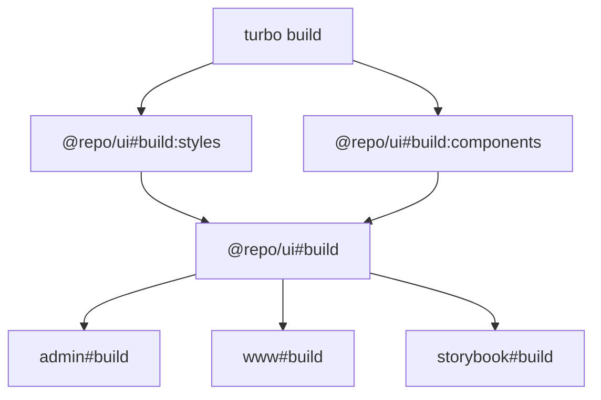

# www.chankay.com

> A modern, full-stack blog platform built with Next.js, PayloadCMS, and TypeScript in a monorepo architecture.

[](https://pnpm.io/)
[](https://turbo.build/)
[](https://nextjs.org/)
[](https://react.dev/)
[](https://payloadcms.com/)
[](https://www.typescriptlang.org/)
[](https://prettier.io/)
[](https://eslint.org/)
[](http://commitizen.github.io/cz-cli/)
[](./LICENSE)
[](./apps/storybook/)

## 🚀 Overview

A comprehensive blog platform leveraging modern web technologies with a focus on performance, developer experience, and content management flexibility. Built as a turborepo monorepo with multiple applications and shared packages.

## 📁 Project Structure

```
www.chankay.com/
├── 📱 apps/
│   ├── admin/          # PayloadCMS admin dashboard
│   ├── storybook/      # Component development environment
│   └── www/            # Public-facing website
├── 📦 packages/
│   ├── eslint-config/  # Shared ESLint configurations
│   ├── tailwind-config/ # Shared Tailwind CSS setup
│   ├── typescript-config/ # TypeScript configurations & types
│   └── ui/             # Shared UI component library
└── 🔧 Configuration files
```

## 🔀 Turbo Build Graph



## ✨ Features

### ✅ Implemented Features

- **🏗️ Monorepo Infrastructure** - Turborepo with unified workflows
- **📝 Content Management** - Full-featured PayloadCMS with custom fields
- **🎨 UI Components** - Shared component library with Storybook
- **🔧 Developer Experience** - TypeScript, ESLint, Prettier with pre-commit hooks
- **🌍 Internationalization** - Multi-language support with custom translation system
- **🎯 SEO Optimization** - Automated SEO management with PayloadCMS SEO plugin
- **🎨 Color Management** - Custom color picker component for brand consistency
- **🔐 Authentication** - NextAuth.js integration with GitHub OAuth
- **📊 Type Safety** - End-to-end TypeScript with auto-generated types
- **🚀 Performance** - Optimized builds and caching strategies

### 🧩 Custom Components

- **ColorPicker** - React-colorful based color picker for PayloadCMS
- **Translation System** - Modular translation adapters (OpenAI, DeepL, Google, Baidu)
- **Language Detection** - Automatic content language detection
- **Custom Field Types** - Reusable field components for PayloadCMS

## 🛠️ Tech Stack

### Core Technologies

- **Frontend Framework**: Next.js 15.3+ with App Router
- **React**: 19.1+ with modern features
- **Content Management**: PayloadCMS 3.46+
- **Language**: TypeScript 5+ with strict mode
- **Styling**: TailwindCSS with design system
- **Monorepo**: Turborepo for build orchestration

### Development Tools

- **Package Manager**: pnpm with workspace support
- **Code Quality**: ESLint + Prettier + lint-staged
- **Testing**: Vitest with coverage
- **Documentation**: Storybook for component development
- **CI/CD**: GitHub Actions with Vercel deployment

### Data & Storage

- **Database**: MongoDB with Mongoose ODM
- **File Storage**: Vercel Blob for media assets
- **Authentication**: NextAuth.js with OAuth providers

## 🚀 Quick Start

### Prerequisites

- Node.js 18+ and pnpm installed
- MongoDB database (local or remote)
- Environment variables configured

### Installation

```bash
# Clone the repository
git clone https://github.com/your-username/www.chankay.com.git
cd www.chankay.com

# Install dependencies
pnpm install

# Set up environment variables
cp apps/admin/.env.example apps/admin/.env.local
cp apps/www/.env.example apps/www/.env.local
# Fill in your environment variables

# Generate TypeScript types
pnpm run gen

# Start development servers
pnpm run dev
```

### Common Commands

```bash
# Development
pnpm run dev                  # Start all development servers
pnpm run dev:admin            # Start admin dashboard only
pnpm run dev:www              # Start public website only
pnpm run dev:ui               # Start Storybook with @repo/ui watch tasks

# Building
pnpm run build                # Build the entire workspace
pnpm --filter @repo/ui build  # Build shared UI package only
pnpm --filter admin build     # Build admin app only
pnpm --filter www build       # Build website only
pnpm --filter storybook build # Build Storybook only

# Code Quality
pnpm run lint                 # Run ESLint on all packages
pnpm run format               # Format code with Prettier
pnpm run format:check         # Check formatting without writing
pnpm run check-types          # TypeScript type checking

# Testing
pnpm run test                 # Run all tests
pnpm run test:run             # Run tests once
```

### Production Release Tags

Production deployments are triggered when a GitHub Release is published with tag prefix:

- `admin-v*` for Admin production workflow
- `www-v*` for WWW production workflow

Steps (GitHub UI):

1. Open `Releases` -> `Draft a new release`
2. Create/select a tag:
   - `admin-v1.2.3` to deploy Admin
   - `www-v1.2.3` to deploy WWW
3. Click `Publish release`

## 📚 Documentation

### For AI-Assisted Development

- **[CLAUDE.md](./CLAUDE.md)** - Comprehensive AI code generation guidelines
- **[.cursorrules](./.cursorrules)** - Quick reference for Cursor AI

These documents ensure consistent, high-quality code generation and provide essential context about the project's architecture, conventions, and best practices.

## 🔧 Development

### Adding New Features

1. **Review Guidelines**: Read `CLAUDE.md` for coding standards and patterns
2. **Create Feature Branch**: Follow git flow with descriptive branch names
3. **Develop with Types**: Use TypeScript throughout for type safety
4. **Component Development**: Use Storybook for isolated component development
5. **Testing**: Write tests for new functionality
6. **Code Quality**: Ensure ESLint and Prettier compliance
7. **Commit**: Follow conventional commit format with scope-based commits

### PayloadCMS Customization

Custom field components are located in `apps/admin/src/components/fields/`:

- ColorPicker component for brand color management
- Factory functions in `apps/admin/src/fields/` for reusability

### Translation System

The translation system supports multiple providers:

- **OpenAI**: GPT-based translation for technical content
- **DeepL**: High-quality general translation
- **Google Translate**: Wide language support
- **Baidu Translate**: Optimized for Chinese translations
- **Mock**: Development and testing

## 🤝 Contributing

1. Fork the repository
2. Create a feature branch (`git checkout -b feature/amazing-feature`)
3. Follow our commit conventions (see `.claude/config` for guidelines)
4. Ensure all tests pass (`pnpm run test`)
5. Submit a pull request with detailed description

## 📄 License

This project is licensed under the MIT License - see the [LICENSE](LICENSE) file for details.

## 🙏 Acknowledgments

- Built with modern web technologies and best practices
- Inspired by the Next.js and PayloadCMS communities
- Thanks to all contributors and open-source projects that make this possible
