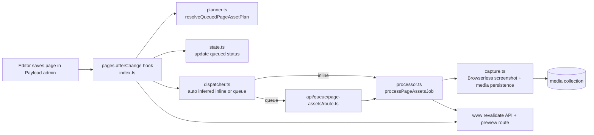
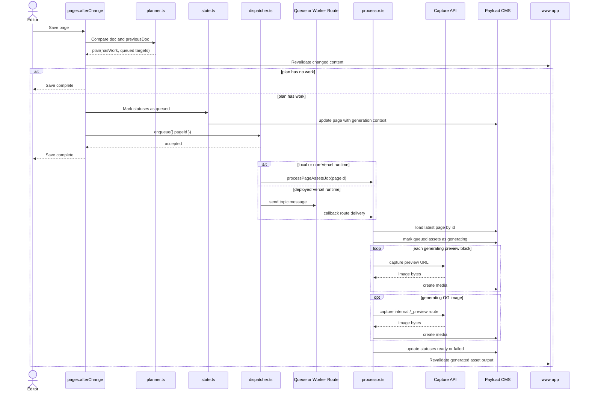
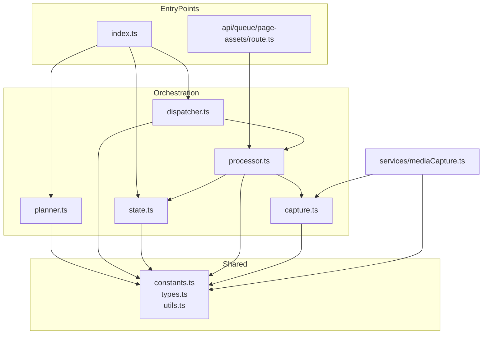
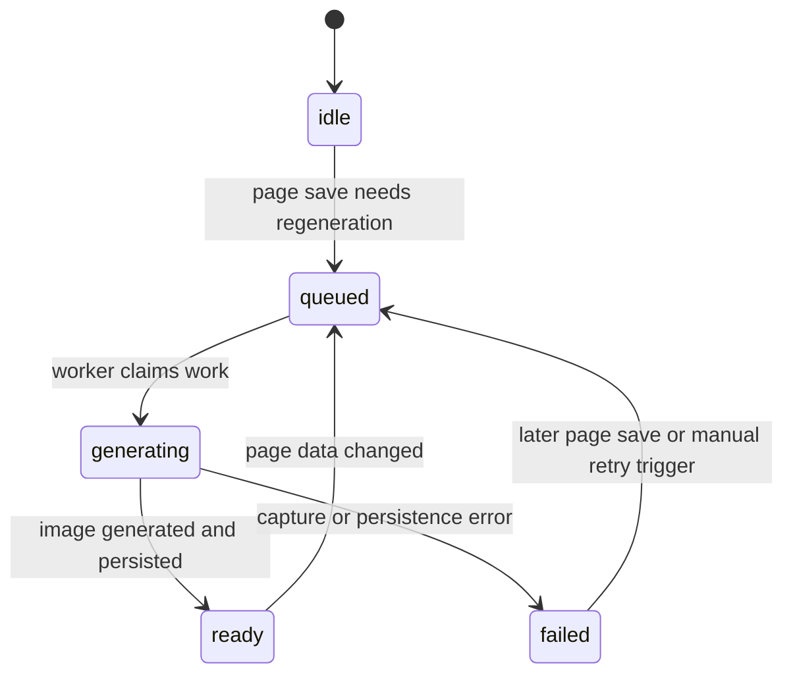

# Page Assets Architecture

## Purpose

This module owns the generated asset pipeline for the `pages` collection.

It is responsible for:

- generating `previewUrl` screenshots for `previewUrl` blocks
- generating screenshot-based OG images for pages
- persisting generated files into the `media` collection
- triggering frontend revalidation after content or generated assets change

It is intentionally not responsible for:

- manual media uploads
- `media.captureUrl` generation for the `media` collection
- queue vendor details beyond the dispatch boundary

## Design Goals

The current implementation is optimized for these constraints:

- page save latency should stay low
- generated asset work should run outside the page save request
- transport should be replaceable
- worker execution should re-read the latest page state instead of trusting stale hook input
- generated media must not recurse into `media.captureUrl`

## High-Level Architecture

## Runtime Flow

### Save Path

When a page is saved, the `afterChange` hook does not generate images inline.

It performs four steps:

1. Build a regeneration plan from `doc` and `previousDoc`.
2. Revalidate the frontend for content changes immediately.
3. Mark affected assets as `queued`.
4. Enqueue a background job with `{ pageId }`.

### Worker Path

The worker receives only `pageId`.

It then:

1. creates a fresh Payload runtime
2. reloads the latest page document
3. moves queued assets to `generating`
4. captures screenshots and persists media
5. updates statuses to `ready` or `failed`
6. revalidates the frontend again so generated asset fields are reflected

## Sequence Diagram

## Module Dependency Graph

## File Responsibilities

| File            | Responsibility                                                                                                                         |
| --------------- | -------------------------------------------------------------------------------------------------------------------------------------- |
| `index.ts`      | `pages.afterChange` entry point. Builds the plan, marks queued state, triggers immediate revalidation, and dispatches background work. |
| `planner.ts`    | Pure planning logic. Decides whether preview block images or OG image need regeneration.                                               |
| `dispatcher.ts` | Transport boundary. Automatically chooses between in-process execution and Vercel Queue delivery.                                      |
| `processor.ts`  | Background worker orchestration. Re-loads the page, transitions states, captures assets, persists media, and revalidates the frontend. |
| `state.ts`      | Runtime creation and page update helpers that always apply the generation context flag.                                                |
| `capture.ts`    | Browserless screenshot request and generated media persistence.                                                                        |
| `constants.ts`  | Shared flags, headers, defaults, and topic names.                                                                                      |
| `types.ts`      | Local runtime and document types.                                                                                                      |
| `utils.ts`      | Shared helpers for block traversal, status parsing, filenames, and normalization.                                                      |

## Dispatch Selection

Dispatch is inferred from the current runtime instead of being configured manually.

### In-process execution

- Uses an in-process `Map<string, Promise<void>>`.
- Serializes jobs per page inside one process.
- Used for local development.
- Used as a fallback outside deployed Vercel runtimes.
- Not durable across restarts or deployments.

### Queue execution

- Publishes `{ pageId }` to the Vercel Queue topic `page-assets`.
- Consumed by `app/api/queue/page-assets/route.ts`.
- Registered through `apps/admin/vercel.json`, which must live inside the admin Vercel project's Root Directory.
- Used automatically on deployed Vercel runtimes.
- Delivery is at-least-once, so processor logic must tolerate retries.

## State Model

Generated asset state uses the same lifecycle for preview blocks and OG images.

State fields:

- `previewStatus` on `previewUrl` blocks
- `ogGenerationStatus` inside `seo`

## Key Invariants

These rules are important for maintainers and future AI agents.

### 1. The hook never performs expensive capture work directly

`index.ts` may update page status fields, but image generation belongs to the processor path only.

### 2. The worker always reloads the latest page by `pageId`

This avoids generating assets from stale hook snapshots when multiple saves happen close together.

### 3. Generated page media must not trigger `media.captureUrl`

`capture.ts` creates `media` documents with `SKIP_MEDIA_SOURCE_CAPTURE_FLAG`.
`services/mediaCapture.ts` respects that flag and exits early.

### 4. Revalidation happens twice for different reasons

- hook-time revalidation makes content changes visible quickly
- processor-time revalidation makes generated `previewImage` and `ogImage` changes visible

### 5. Transport is replaceable, processor is canonical

If queue infrastructure changes in the future, prefer replacing `dispatcher.ts` and the worker entrypoints instead of rewriting `processor.ts`.

## External Dependencies

This module depends on these runtime contracts:

- `PREVIEW_CAPTURE_API_URL` and `PREVIEW_CAPTURE_API_KEY` for Browserless screenshots
- `WWW_INTERNAL_SECRET` for authenticated preview capture and frontend revalidation
- `site-config.siteUrl` or `WWW_SITE_URL` to resolve frontend URLs

## Relationship To `media.captureUrl`

This module and `services/mediaCapture.ts` share the screenshot infrastructure in `capture.ts`, but they are different pipelines.

Differences:

- `pageAssets` starts from `pages.afterChange`
- `mediaCapture` starts from `media.beforeOperation`
- `pageAssets` always creates a file-backed `media` document
- `mediaCapture` creates `req.file` from `captureUrl`

The skip flag boundary is deliberate and should be preserved.

## Failure Model

Current behavior is intentionally pragmatic:

- dispatch failure during the hook turns `queued` assets into `failed`
- capture failure during processing moves the target asset to `failed`
- queue delivery may happen more than once
- no distributed page lock exists yet

This is acceptable because:

- the worker reloads the latest page before mutating state
- only `queued` items are promoted to `generating`
- only `generating` items are finalized to `ready` or `failed`

This makes the system retry-friendly, even though it is not a fully locked workflow engine.

## Worker Entry Point

### Queue Callback Route

File:

- `apps/admin/src/app/api/queue/page-assets/route.ts`

Responsibilities:

- accept Vercel Queue callback messages
- apply retry policy
- forward `{ pageId }` to `processPageAssetsJob`

## Testing Strategy

Current focused coverage includes:

- planner behavior
- dispatch inference behavior
- queue callback route behavior
- media capture skip-flag behavior

Recommended future coverage:

- processor concurrency and repeated delivery behavior
- integration coverage for queue mode in a real Vercel-linked environment
- regression coverage for content revalidation versus generated asset revalidation

## Extension Guidance

If you need to change this module:

1. Keep `processor.ts` as the single source of truth for generation behavior.
2. Prefer adding new dispatch transports in `dispatcher.ts`.
3. Keep `planner.ts` pure and deterministic.
4. Do not remove the media skip flag unless the media pipeline is redesigned together.
5. Update this README when module boundaries or worker entrypoints change.
