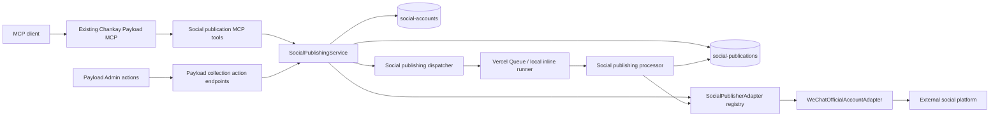

# Manual Social Publishing through Payload MCP

## Implementation Status

Phases 1–3 are implemented on `feat/social-publishing`, with unit and mocked-provider verification and an isolated Admin build. The operational account/API verification gates below remain pending; remote writes, deployment secrets, and production MCP permissions have not been enabled. See `docs/superpowers/plans/2026-09-08-social-publishing.md` for execution and validation details and `docs/deployment-and-environments.md` for enablement and recovery.

## Goal

Add a manual, auditable social publishing capability to the existing Chankay Payload CMS. An authorized operator can select an existing Post and locale, prepare a platform-specific publication, create a remote draft when the platform supports one, review the exact prepared snapshot, and explicitly confirm the final external publication.

The first adapter targets one WeChat Official Account. The domain model and service boundary must support additional accounts and platforms without coupling Posts or MCP tools to WeChat-specific concepts.

## Repository Baseline

This design is based on the current repository architecture, not a standalone MCP implementation.

- `apps/admin` owns Payload CMS and is deployed as a separate Vercel project.
- Payload and `@payloadcms/plugin-mcp` are pinned to `3.88.0`.
- `apps/admin/src/plugins/mcp/index.ts` already registers `payloadMcpPlugin` and the `Chankay Payload MCP` server.
- Custom MCP tools are plain `{ name, description, parameters, handler }` definitions registered through the existing top-level `mcp.tools` array.
- Payload generates the `payload-mcp-api-keys` collection, associates each key with a user, and stores per-collection, per-global, and per-tool permissions.
- `apps/admin/src/plugins/mcp/collections.ts` centrally declares native collection capabilities.
- The current secure custom-tool pattern is the SiteConfig translation tool: accept `PayloadRequest`, use `req.payload`, pass `req` and `req.user`, and set `overrideAccess: false` for user-authorized operations.
- Posts contain localized `title`, `excerpt`, and Markdown `content`; `status`, `publishedAt`, `featuredImage`, and `primaryTag` are shared.
- CMS localization enables fallback, so social publishing must explicitly disable fallback when loading a requested locale.
- `primaryTag` is required on the current `origin/master` Post model and distinguishes Technical and Trading sections.
- `apps/admin/src/services/pageAssets` provides the repository's current dispatcher/processor pattern: inline execution in local development and Vercel Queue delivery in deployed Vercel environments.
- Admin API functions have a 60-second maximum duration.
- The current `origin/master` Admin dependencies already include `marked` and `htmlparser2`, which can support a validated Markdown-to-platform rendering pipeline without adding a speculative parsing dependency.

The local checkout was 60 commits behind `origin/master` when this design was written. The MCP directory was unchanged across that range. Post validation and section behavior in this document follow the newer `origin/master` state.

## Problems

1. A Post has no durable record of where a specific locale was distributed, which content was sent, who approved it, or what the remote platform returned.
2. Directly adding WeChat fields to Posts would couple the editorial source model to one platform and would not support multiple accounts, locales, repeated revisions, or future platforms.
3. A long-running sequence of media uploads, remote draft creation, publication submission, and status polling does not fit safely inside a Post save hook or a single MCP request.
4. CMS locale fallback can make missing Chinese content appear to exist by returning English content.
5. Remote APIs and at-least-once queue delivery can produce duplicate drafts or publications unless commands are idempotent and ambiguous outcomes stop automatic retries.
6. Native collection CRUD is too broad for publication state transitions. A caller must not be able to write `published`, remote identifiers, approval fields, or prepared payloads directly.

## Constraints and Assumptions

- The initial account is an authenticated WeChat Official Account with the API permissions required for draft and publication operations.
- The production account's exact API availability, quotas, IP restrictions, publication behavior, and article limits must be verified before implementation is considered deployable.
- Initial traffic is low enough that one publication record and a bounded attempt history per target are sufficient. A separate event-store collection is not required initially.
- Source content must be an existing Payload Post plus an explicit supported locale. MCP does not accept arbitrary article bodies.
- The source Post must be published and must satisfy the selected Social Account's content policy.
- A publication targets exactly one Social Account. Publishing one Post to two accounts creates two independent Social Publication records.
- An explicit final MCP or Admin action is the approval event. Dual-control approval by two different people is outside the initial scope.
- Payload MCP API keys remain the transport authentication and tool-authorization mechanism. No new MCP server, endpoint, OAuth service, or token collection is introduced.

## Requirements

### Functional Requirements

1. Manage one or more Social Accounts in Payload Admin.
2. Associate each Social Account with one platform, an immutable non-secret provider account identity, allowed locales, optional eligible primary Tags, non-secret platform settings, and a server-side credential reference.
3. Prepare a Social Publication only from an existing published Post and an explicit locale.
4. Load localized Post fields with `fallbackLocale: false` and reject missing required localized values.
5. Freeze the reviewed destination identity, source, adapter version, rendering settings, and platform-prepared output in an immutable snapshot identified by a hash.
6. Create a remote draft on platforms that declare remote-draft support.
7. Require a separate final action with the expected snapshot hash before external publication.
8. Support the same prepare, draft, and publish commands from Payload Admin and the existing Payload MCP server.
9. Persist normalized remote identifiers, status, operator identity, timestamps, attempts, and sanitized errors.
10. Allow safe retry of a known failed stage while preventing blind retry of an ambiguous remote result.
11. Let authorized MCP clients discover Social Accounts and Social Publications through native Payload MCP find operations.

### Non-Functional Requirements

1. MCP and Admin entry points must call the same domain service.
2. A normal Post save must never call a social platform or create a publication automatically.
3. Deployed remote operations must run through the existing Vercel Queue pattern and return quickly to the initiating request.
4. Secrets and access tokens must never be stored in normal CMS fields, returned through MCP, sent in queue messages, or written to logs.
5. User-authorized Payload operations must preserve normal Payload access control.
6. Queue processors must tolerate duplicate delivery.
7. Adding a platform must not require adding platform-specific fields to Posts or new platform-specific MCP tools.
8. Credential rotation must not be able to redirect an approved publication to a different provider account.

## Goals and Non-Goals

### Goals

- Establish a reusable social publishing domain beside Posts.
- Deliver a safe manual WeChat draft and publication workflow.
- Integrate through the repository's existing Payload MCP implementation.
- Preserve a reviewable, immutable record of the exact content sent externally.
- Make future platform adapters additive rather than invasive.

### Non-Goals

- Automatic Post hooks or rule-triggered distribution.
- Scheduled publication.
- Arbitrary content supplied directly by MCP.
- Cross-platform analytics.
- A universal cross-platform rich-text editor.
- Multiple-approver workflows.
- Deleting published audit records.
- Automatically granting the new MCP permissions to existing API keys.
- Migrating the existing Post/Page MCP tools to a newer plugin API.

## Considered Solutions

| Option                                                                                  | Benefits                                                                             | Costs / Risks                                                                                             | Decision |
| --------------------------------------------------------------------------------------- | ------------------------------------------------------------------------------------ | --------------------------------------------------------------------------------------------------------- | -------- |
| Add WeChat fields and actions directly to Posts                                         | Smallest initial schema change                                                       | Couples Post state to one account and platform; cannot model revisions, retries, or multiple destinations | Rejected |
| Let MCP call WeChat directly                                                            | Minimal CMS code                                                                     | Bypasses Payload authorization, snapshots, audit history, and shared Admin behavior                       | Rejected |
| Add Social Accounts and Social Publications, with shared services and platform adapters | Durable history, reusable entry points, multi-account and multi-platform growth path | Adds two domain collections and a state machine                                                           | Selected |

The selected design intentionally uses a small adapter registry rather than a dynamic plugin marketplace. Platform adapters are code modules registered in one map. This leaves a stable extension point without building infrastructure that the current product does not need.

## Architecture



### Key Decisions

- The existing Payload MCP endpoint remains the only MCP transport.
- MCP tools are thin adapters over `SocialPublishingService`.
- Admin controls call the same service through authenticated custom endpoints on the Social Publications Payload collection.
- Preparation is deterministic and does not publish externally.
- Remote draft creation and final publication are distinct commands.
- Deployed remote work is asynchronous because media processing and platform calls can exceed the 60-second request budget.
- The worker receives identifiers only and reloads current state from Payload.
- Post hooks are unchanged.

## Components and File Placement

```text
apps/admin/src/
├── collections/
│   ├── SocialAccounts.ts
│   ├── SocialPublications.ts
│   └── index.ts
├── plugins/mcp/
│   └── social-publication/
│       ├── index.ts
│       ├── prepare.ts
│       ├── createDraft.ts
│       ├── publish.ts
│       └── shared.ts
├── services/socialPublishing/
│   ├── adapters/
│   │   ├── types.ts
│   │   ├── registry.ts
│   │   └── wechat/
│   │       ├── client.ts
│   │       ├── index.ts
│   │       ├── media.ts
│   │       ├── renderer.ts
│   │       └── tokenProvider.ts
│   ├── dispatcher.ts
│   ├── endpoints.ts
│   ├── processor.ts
│   ├── snapshot.ts
│   ├── state.ts
│   ├── validation.ts
│   └── index.ts
├── components/socialPublishing/
│   ├── PostSocialPublishingActions.tsx
│   └── SocialPublicationActions.tsx
└── app/api/queue/social-publications/route.ts
```

The Admin components remain under `apps/admin` because they depend on Payload identity, document state, and business commands. No reusable stateless UI primitive is required initially, so this feature does not add a component to `packages/ui`.

### Existing Files to Modify

- `apps/admin/src/collections/index.ts`: export the two collections.
- `apps/admin/src/payload.config.ts`: register the two collections.
- `apps/admin/src/plugins/mcp/collections.ts`: expose native find only for both collections.
- `apps/admin/src/plugins/mcp/index.ts`: append `socialPublicationTools` to the existing `mcp.tools` array.
- `apps/admin/vercel.json`: register the `social-publications` queue topic and callback route.
- `apps/admin/.env.example`: document the non-secret names of required WeChat credential variables.
- `docs/deployment-and-environments.md`: document the new queue and credential contract.
- `docs/payload-cms-patterns.md`: add the stable social publishing collection and service boundary after implementation is verified.

## Platform Adapter Boundary

```typescript
type SocialPlatform = "wechat-official-account"

type SocialPlatformCapabilities = {
  asyncPublishStatus: boolean
  remoteDraft: "required" | "optional" | "unsupported"
}

interface SocialPublisherAdapter {
  platform: SocialPlatform
  capabilities: SocialPlatformCapabilities
  validateAccount(account: SocialAccount): Promise<ValidationResult>
  prepare(input: PublicationSourceSnapshot): Promise<PreparedPlatformPayload>
  createDraft?(
    input: PreparedPlatformPayload,
    context: AdapterExecutionContext
  ): Promise<RemoteDraftResult>
  publish(
    input: PreparedPlatformPayload,
    context: AdapterExecutionContext
  ): Promise<RemotePublishSubmission>
  getStatus?(
    input: RemotePublishSubmission,
    context: AdapterExecutionContext
  ): Promise<RemotePublishResult>
}
```

The shared service uses capabilities instead of assuming every platform has WeChat's draft workflow. The initial `SocialPlatform` union contains only WeChat; adding a platform extends the union, adds validated account settings and prepared-payload types, and registers one adapter.

`PreparedPlatformPayload` and provider metadata are server-owned discriminated unions. They may be persisted in Payload JSON fields, but MCP and ordinary Admin document updates cannot write them. The selected adapter validates the stored discriminator and shape before every remote operation.

The server-only credential provider returns both the resolved secret material and its stable provider account identity. Before any remote mutation, the service compares that identity with the immutable `providerAccountId` stored on the Social Account and copied into the publication snapshot. A mismatch fails closed before the adapter is called.

## Database Model

### Social Accounts

`social-accounts` is a repeatable operational configuration collection.

| Field                    | Type / Behavior                                                             |
| ------------------------ | --------------------------------------------------------------------------- |
| `name`                   | Required display name                                                       |
| `platform`               | Required select; initially `wechat-official-account`                        |
| `providerAccountId`      | Required stable non-secret provider identity; immutable after creation      |
| `enabled`                | Required checkbox; disabled accounts reject new commands                    |
| `defaultLocale`          | Supported locale select                                                     |
| `allowedLocales`         | Supported locale select, many                                               |
| `eligiblePrimaryTags`    | Optional relationship to Tags, many; empty means any primary Tag            |
| `credentialReference`    | Required validated identifier resolved by a server-only credential provider |
| `platformSettings`       | Conditional, typed non-secret settings for the selected platform            |
| `createdAt`, `updatedAt` | Payload timestamps                                                          |

Access policy:

- authenticated users may read accounts
- Admin users may create, update, enable, disable, or delete unused accounts
- Editors cannot change account configuration
- `platform` and `providerAccountId` are immutable after creation; targeting another remote account requires a new Social Account
- MCP native capability is `find` only
- `credentialReference` is hidden from MCP-native reads with field-level read access based on `req.payloadAPI`
- MCP custom tools never return `credentialReference`
- account deletion is rejected while any Social Publication references the account

The first credential provider reads deployment secrets through a code-owned allowlist. A value stored in `credentialReference` is never concatenated unchecked into an environment-variable name or secret-manager path. Administrators may rotate `credentialReference`, but resolved credentials must identify the same `providerAccountId`; otherwise validation and every remote command fail closed. Future external secret-manager support replaces the provider without changing the collection or adapter interface.

### Social Publications

`social-publications` is an operational record, not a Payload draft-enabled editorial document.

| Field                                   | Type / Behavior                                                                          |
| --------------------------------------- | ---------------------------------------------------------------------------------------- |
| `sourcePost`                            | Required relationship to Posts                                                           |
| `sourceLocale`                          | Required supported locale                                                                |
| `sourceUpdatedAt`                       | Post timestamp captured at preparation                                                   |
| `sourceHash`                            | Hash of normalized localized source fields and referenced media                          |
| `account`                               | Required relationship to Social Accounts                                                 |
| `platform`                              | Copied platform discriminator for durable history                                        |
| `providerAccountId`                     | Copied immutable provider destination identity                                           |
| `idempotencyKey`                        | Unique and indexed `SHA-256("prepare:v1:" + snapshotHash)`                               |
| `status`                                | Server-managed lifecycle state                                                           |
| `snapshot`                              | Server-managed immutable source snapshot                                                 |
| `preparedPayload`                       | Server-managed, adapter-validated platform payload                                       |
| `snapshotHash`                          | Hash of the complete reviewed output                                                     |
| `approval`                              | Actor, entry point, expected snapshot hash, and timestamp                                |
| `remote`                                | Normalized draft ID, publication ID, URL, remote status, and validated provider metadata |
| `attempts`                              | Bounded server-managed attempt summaries                                                 |
| `lastError`                             | Sanitized stage, code, message, retryability, ambiguity, and timestamp                   |
| `createdAt`, `updatedAt`, `publishedAt` | Payload timestamps                                                                       |

The immutable snapshot contains the Social Account ID, platform, `providerAccountId`, exact localized title, excerpt, Markdown, selected cover Media ID, canonical source URL, referenced image IDs, adapter version, and normalized non-secret rendering settings. The prepared payload contains the exact platform-formatted title, summary, body, cover, and uploaded-media mapping reviewed before publication.

Access policy:

- authenticated users may read publications
- ordinary Collection create, update, and delete are denied
- internal service operations carry a private request context flag; collection access permits the authenticated service command while normal access control remains enabled
- trusted queue-worker state updates use server authority after reloading and validating the queued command
- MCP native capability is `find` only
- published records cannot be deleted through this feature

### Status Model

```mermaid
stateDiagram-v2
	[*] --> preparing
	preparing --> prepared
	preparing --> failed
	prepared --> draft_queued: create draft command
	draft_queued --> draft_creating: worker claims
	draft_creating --> draft_ready
	draft_creating --> failed
	prepared --> publish_queued: platform has no remote draft
	draft_ready --> publish_queued: explicit confirmation
	publish_queued --> publishing: worker claims
	publishing --> published
	publishing --> failed
	publishing --> status_check_queued: remote accepted; result pending
	publishing --> unknown: submission result is ambiguous
	status_check_queued --> status_checking: worker claims
	status_checking --> published
	status_checking --> failed
	status_checking --> status_check_queued: still pending; delayed redelivery
	status_checking --> unknown: status result is ambiguous
	unknown --> status_check_queued: known remote ID can be reconciled
	failed --> draft_queued: retryable non-ambiguous draft failure
	failed --> publish_queued: new confirmation for retryable non-ambiguous publish failure
	prepared --> cancelled
	draft_ready --> cancelled
```



The approval record is written atomically when the final publish command transitions `prepared`, `draft_ready`, or an eligible retryable `failed` record to `publish_queued`. A publish retry records a new approval for the same exact snapshot hash. There is no separate `approved` state in the initial design, which prevents an approval from becoming detached from the command it authorized.

## MCP Integration

### Registration

Add a sibling tool module under the current MCP plugin:

```typescript
import { socialPublicationTools } from "./social-publication"

export const payloadMcpPlugin = mcpPlugin({
  collections: mcpCollections,
  globals: mcpGlobals,
  mcp: {
    // Existing options remain unchanged.
    tools: [...postTools, ...pageTools, ...siteConfigTools, ...socialPublicationTools],
  },
})
```

Payload 3.88 custom tools remain in the top-level tools array. This design does not use unreleased resource-scoped helpers or migrate existing tools.

### Native MCP Collection Access

Add both domain collections to `mcpCollections` with read-only capabilities:

```typescript
enabled: {
	find: true,
	create: false,
	update: false,
	delete: false,
}
```

Authorized clients use the existing native find tool to discover accounts and inspect publication status. All mutations use the narrow custom commands below.

### Custom Tool Contracts

#### `prepare_social_publication`

Input:

```typescript
{
  accountId: string
  locale: SupportedLocale
  postId: string
}
```

Behavior:

1. Authenticate the Payload MCP request and verify custom-tool permission.
2. Load the account and published Post as the effective Payload user.
3. Read the requested locale with `fallbackLocale: false`.
4. Enforce the account's locale and primary-Tag policy.
5. Resolve only permitted Payload Media references.
6. Build the source snapshot, call the selected adapter's pure preparation step, validate output, and assemble the complete immutable snapshot including provider destination identity, adapter version, and normalized rendering settings.
7. Compute `snapshotHash`, derive `idempotencyKey = SHA-256("prepare:v1:" + snapshotHash)`, and return the matching record or create a new `prepared` record.

Result includes the publication ID, status, snapshot hash, sanitized preview summary, warnings, and platform capabilities. It does not expose raw provider settings or credentials.

#### `create_social_draft`

Input:

```typescript
{
  expectedSnapshotHash: string
  publicationId: string
}
```

Behavior:

1. Require a platform whose adapter declares remote-draft support.
2. Verify account state, tool permission, and exact snapshot hash. Eligible records are `prepared`, or `failed` records whose last stage is `token`, `media`, or `create-draft`, whose error is retryable and non-ambiguous, and which have no stored remote draft ID.
3. Atomically transition the eligible state to `draft_queued` and append a new attempt record.
4. Dispatch `{ action: "create-draft", publicationId }`.
5. Return the queued record summary. Repeated calls for queued, in-progress, or completed records return current state. A record with an ambiguous result or remote draft ID is never re-enqueued for draft creation.

#### `publish_social_publication`

Input:

```typescript
{
  expectedSnapshotHash: string
  publicationId: string
}
```

Behavior:

1. This is the explicit confirmation boundary. Its description must instruct clients to call it only after showing the prepared summary and receiving user confirmation.
2. Verify account state, publisher role, custom-tool permission, and exact snapshot hash. Eligible records are `prepared` for platforms without remote drafts, `draft_ready`, or `failed` records whose last stage is `publish`, whose error is retryable and non-ambiguous, and which have no stored submission or publication ID.
3. Record the effective Payload user, entry point `mcp`, snapshot hash, and approval time for this publication attempt.
4. Atomically transition the eligible state to `publish_queued`, append a new attempt record, and dispatch `{ action: "publish", publicationId }`.
5. Return the queued record summary. Repeated calls return the existing submission or final status.

Payload MCP 3.88 does not provide a cryptographic proof that a human saw a client confirmation dialog. The enforceable server boundary is a separately permissioned publication tool plus an exact snapshot hash. Client UX confirmation remains part of the tool contract. Admin uses an explicit confirmation dialog before invoking the same service command.

### Handler Pattern

New tools follow the current secure SiteConfig pattern rather than the older Post/Page helper pattern:

- parse the complete input with Zod
- accept `PayloadRequest` as the second handler argument
- use `req.payload`
- pass `req`, `req.user`, and `overrideAccess: false` for effective-user reads and command creation
- never call `getPayloadInstance()` from an MCP handler
- never use unconditional `overrideAccess: true` for an MCP-authorized operation
- return a compact result with `createTextResult`

The generated MCP API-key schema adds one disabled-by-default permission for each custom tool. Existing keys require an explicit manual permission update after deployment.

## Admin Interaction

The Admin UI exposes the same three commands:

- A Post-side action starts preparation for the active locale and selected Social Account.
- A Social Publication view shows the snapshot summary, warnings, current Post staleness, remote state, and sanitized last error.
- `Create remote draft` is available only when the adapter supports it.
- `Confirm and publish` displays account, platform, locale, title, and snapshot hash before calling the service.

Custom endpoints on the Social Publications collection authenticate through Payload, derive the current user from the request, and call `SocialPublishingService`. They do not duplicate adapter or state-machine logic. Keeping these endpoints in the collection preserves the existing Payload `/api` routing instead of adding a parallel Admin API surface.

If the source Post changes after preparation, the existing publication remains an accurate historical snapshot. The UI marks it stale and requires preparation of a new publication rather than mutating the reviewed record.

## Content Preparation

### Source Validation

- Post `status` must be `published`.
- `title` and `content` must explicitly exist in the requested locale.
- `fallbackLocale` must be `false` for publication reads.
- The account must be enabled and allow the locale.
- If `eligiblePrimaryTags` is non-empty, the Post's required `primaryTag` must match one of them.
- A cover must resolve from an explicitly selected Post `featuredImage` or a permitted Payload Media reference in content. Missing cover blocks WeChat preparation.
- Arbitrary remote images are rejected in the initial version. Editors must first add them to the Payload Media collection. This avoids an SSRF-capable downloader in the publishing worker.

### Snapshot Hash

Normalize and hash:

- Social Account ID, platform, and immutable `providerAccountId`
- Post ID and source locale
- localized title, excerpt, and Markdown
- selected cover Media ID
- ordered referenced Media IDs
- canonical source URL
- adapter version and non-secret rendering settings
- complete prepared payload

Approval and queue execution both verify this hash. A renderer or settings change naturally produces a new publication record.

`credentialReference` and secret material are excluded from the snapshot. Rotation is safe because the worker resolves credentials immediately before execution and requires the resolved provider identity to equal the snapshot's `providerAccountId` before making a remote call.

Remote execution uses the snapshotted adapter version and normalized non-secret rendering settings, not mutable current account settings. Current account state is reloaded only for authorization, enablement, platform compatibility, credential resolution, and provider identity validation.

### WeChat Preparation

The WeChat adapter initially supports:

- headings, paragraphs, emphasis, lists, blockquotes, links, inline code, code blocks, separators, and Payload Media images
- Markdown parsing with the repository's existing `marked` dependency
- DOM parsing and allowlist reconstruction with the existing `htmlparser2` dependency
- explicit removal of scripts, iframes, event handlers, unsafe URLs, and unsupported elements
- bounded inline styles suitable for mobile article rendering
- cover and inline-image uploads
- normalized remote draft and publication identifiers

Tables and raw embedded HTML are blocked during preparation until a verified platform-safe transformation is implemented. Unsupported input fails visibly instead of being silently removed.

## Queue and Worker Design

Manual initiation does not imply synchronous remote execution.

### Dispatch

Reuse the page-assets transport policy in a separate social-publishing dispatcher:

- local development: serialized in-process execution per publication
- deployed Vercel: Vercel Queue topic `social-publications`
- non-Vercel fallback: in-process execution, documented as non-durable

Queue messages contain only:

```typescript
{
  action: "create-draft" | "publish" | "status-check"
  publicationId: string
}
```

They never contain article content, prepared payloads, secrets, access tokens, or operator data.

### Processor

The canonical processor:

1. reloads the Social Publication at depth zero
2. verifies the queued action and claims it with one conditional transition: `draft_queued` to `draft_creating`, `publish_queued` to `publishing`, or `status_check_queued` to `status_checking`
3. reloads the referenced account and immutable prepared payload
4. resolves credentials server-side and verifies that their provider identity matches the account and snapshot `providerAccountId`
5. calls the registered adapter mutation for draft or publish, or the adapter's read-only `getStatus` operation for `status-check`
6. persists each known remote identifier before advancing
7. polls only when the adapter declares async status support and the current execution budget allows it
8. when publication remains pending, atomically returns the record to `status_check_queued` and schedules a delayed `{ action: "status-check", publicationId }` delivery
9. writes `published`, `failed`, or `unknown` with sanitized metadata

Vercel Queue is at-least-once. Only the worker that successfully claims the expected queued state may call the platform.

`status-check` never performs a create or publish mutation. Deliveries use adapter-bounded exponential backoff and a maximum attempt count. A duplicate delivery that cannot claim `status_check_queued` returns current state. Exhausted or ambiguous status lookup moves to `unknown`; when a known remote identifier remains queryable, an internal reconciliation request may atomically re-enter `status_check_queued` without repeating publication.

## Idempotency and Failure Handling

### Idempotency

- Preparation key: `SHA-256("prepare:v1:" + snapshotHash)`; the complete snapshot includes account and provider identity, Post and locale, source content, referenced media, adapter version, normalized non-secret rendering settings, and the prepared payload.
- Remote draft creation returns immediately when a stored draft ID already exists.
- Publication returns immediately when a submission or final publication ID already exists.
- A mutation worker may only claim the exact expected queued state, and a status worker may only claim `status_check_queued`.
- A retryable `failed` record can re-enter a mutation queue only when its stage matches the requested command, `ambiguous` is false, and no corresponding remote identifier exists.
- Repeated MCP or Admin commands report current state instead of creating duplicate work.

### Ambiguous Remote Results

If a platform request may have succeeded but the response was lost, the processor must not automatically repeat the external mutation.

- If the adapter can query by a known submission identifier, transition to `unknown` and reconcile through the read-only `status-check` queue action.
- If no identifier exists and the platform provides no idempotency key or lookup, stop in `unknown` and require an operator to inspect the remote account.
- An operator may then attach a verified remote identifier through a narrowly scoped recovery action added only when the first real incident demonstrates the need. Generic field editing remains disallowed.

### Error Shape

```typescript
type SocialPublicationError = {
  ambiguous: boolean
  code?: string
  message: string
  occurredAt: string
  retryable: boolean
  stage: "prepare" | "token" | "media" | "create-draft" | "publish" | "status-check"
}
```

Provider response bodies, request headers, token-bearing URLs, stack traces, and secrets are never persisted or returned to MCP.

## Authorization and Audit

The existing Payload user roles are reused:

- `editor` and `admin`: prepare and create a remote draft
- `admin`: manage Social Accounts and perform final publication

Each MCP custom tool also requires its generated `payload-mcp-tool` permission on the active Payload MCP API key. Both the user role and key permission must allow the command.

The service normalizes the effective actor from the Payload request and the MCP API-key owner relationship. Stored approval data identifies the Payload User, not the secret API-key value.

Audit fields record:

- actor User ID
- entry point: `admin` or `mcp`
- action
- previous and next status
- snapshot hash
- timestamp
- sanitized remote result summary

The initial attempt history is bounded to prevent unbounded document growth. If operational usage demonstrates a need for immutable high-volume history, attempts can move to a separate collection without changing the main publication contract.

## Security Design

| Risk                                            | Mitigation                                                                                   |
| ----------------------------------------------- | -------------------------------------------------------------------------------------------- |
| MCP caller bypasses publication state           | Disable native create/update/delete and expose narrow custom commands only                   |
| Local API bypasses access control               | Pass `req`, the effective user, and `overrideAccess: false` for user-authorized operations   |
| Secret exposure                                 | Resolve credentials only in server-side adapter execution; redact logs and errors            |
| Arbitrary URL / SSRF through images             | Accept Payload Media references and configured first-party media origins only                |
| XSS or unsupported HTML                         | Parse Markdown, reconstruct an explicit allowlist, and reject unsupported unsafe content     |
| English fallback published as Chinese           | Always query the source locale with fallback disabled and validate required localized fields |
| Stale approval                                  | Bind the final command to `expectedSnapshotHash`                                             |
| Duplicate queue delivery                        | Conditional state claims and stored remote identifiers                                       |
| Ambiguous timeout causes duplicate post         | Stop in `unknown`; reconcile before retry                                                    |
| MCP key gains tools silently                    | New tool permissions remain disabled for existing keys until manually enabled                |
| Account config points to arbitrary secret names | Validate credential references against a code-owned allowlist                                |
| Credential rotation redirects an approval       | Freeze `providerAccountId` and reject resolved credential identities that do not match       |
| Async publication remains stuck in progress     | Use explicit claimed `status-check` deliveries with bounded backoff and terminal `unknown`   |

## Testing Strategy

### Unit Tests

- locale validation and `fallbackLocale: false` behavior
- account locale and primary-Tag policy
- source and snapshot hash stability, including changes to provider identity, adapter version, and rendering settings
- adapter registry selection and unsupported-platform errors
- allowed Markdown conversion and unsafe HTML rejection
- first-party Media resolution and arbitrary remote-image rejection
- legal and illegal state transitions, including status-check claims and delayed redelivery
- idempotency-key generation from the complete snapshot hash
- error sanitization and token-bearing URL redaction
- role and MCP tool permission checks

### MCP Tool Tests

Follow the current SiteConfig MCP test style with mocked `PayloadRequest`:

- schema rejects missing and invalid identifiers
- handlers use `req.payload`, `req`, effective user, and `overrideAccess: false`
- preparation rejects missing explicit locale content
- draft and publish commands reject snapshot mismatch
- draft and publish retries accept only matching non-ambiguous retryable failures without remote identifiers
- publish rejects non-Admin users
- repeated commands return current state
- handlers never return credential references or provider payloads
- `socialPublicationTools` is appended to the current MCP registry
- generated tool names appear as disabled-by-default API-key permissions after type generation

### Service and Processor Tests

- prepare creates one record per idempotency key
- duplicate queue delivery results in one claim
- credential resolution rejects a provider identity that differs from the immutable account and snapshot identity
- known remote IDs suppress repeated mutations
- transient failures become retryable failures
- ambiguous timeouts become `unknown`
- status-check delivery performs only read operations, uses bounded backoff, and cannot duplicate publication
- source Post edits do not mutate an existing snapshot
- disabled accounts stop new work
- queue messages contain identifiers only

### Adapter Contract Tests

Use a local HTTP mock, never a real WeChat account, for automated tests:

- token success, expiry, and invalid-token retry
- inline image and cover upload
- draft success and validation failure
- publication submission success
- async processing, success, and final failure
- rate limiting, timeouts, malformed responses, and server errors
- sanitization of all returned errors

### Verification Commands

Run at minimum:

```bash
pnpm --filter admin test:run
pnpm --filter admin check-types
pnpm --filter admin build
pnpm format:check
git diff --check
```

Manual development validation uses a test or sandbox WeChat account and a development MCP API key with only the required find and custom-tool permissions. Production publication is never used as a smoke test.

## Implementation Phases

### Phase 1: Domain and Preparation

- Add Social Accounts and Social Publications.
- Add access rules, immutable provider account identity, server-managed fields, adapter types, registry, validation, snapshotting, and state transitions.
- Add native MCP find capabilities for the two collections.
- Add `prepare_social_publication` and its Admin action.
- Implement deterministic WeChat rendering and preview without remote writes.

### Phase 2: Remote Draft

- Implement the credential provider, WeChat client, token provider, media uploads, and draft creation.
- Add the dispatcher, queue callback, processor, and `create_social_draft`.
- Add Admin status and remote-draft actions.

### Phase 3: Explicit Publication

- Add `publish_social_publication`, Admin confirmation, approval audit fields, and the `status-check` queue path for async reconciliation.
- Complete failure, retry, unknown-state, and remote-link behavior.
- Enable new MCP permissions manually for approved development keys.

### Phase 4: Production Readiness

- Verify the production WeChat account's API permissions, quotas, IP restrictions, stable-token behavior, image constraints, draft semantics, publication semantics, and result lookup against current official documentation and the actual account console.
- Run sandbox and preview-environment acceptance tests.
- Update operational documentation and configure production secrets through the deployment platform.
- Enable production MCP tool permissions only after an explicit operational review.

## Rollout and Rollback

### Rollout

1. Deploy schema and preparation support with all new custom-tool permissions disabled on existing keys.
2. Create the first Social Account in development with its immutable non-secret provider account identity and credential reference.
3. Enable find and prepare permissions on one development MCP key.
4. Validate snapshots and previews without remote mutation.
5. Configure development secrets and validate remote drafts.
6. Enable final publication permission only after draft behavior is accepted.
7. Repeat the permission and credential setup explicitly in production.

### Rollback

- Disable the Social Account to stop new commands immediately.
- Disable the three custom tools on MCP API keys.
- Pause or remove the social-publications queue trigger.
- Revert application code and schema through version control.
- Preserve Social Publication records for audit; rollback must not delete published history or remote content.
- Remote platform deletion, if ever required, is a separate explicitly approved operational action.

## Acceptance Criteria

- No Post hook creates or publishes social content.
- An authorized operator can prepare a published Post's explicit `zh-CN` content without locale fallback.
- Missing Chinese content cannot materialize from English fallback.
- Preparation produces a stable immutable snapshot and hash.
- The snapshot binds the immutable provider account identity, and credential rotation cannot redirect execution to another account.
- The WeChat adapter can create one remote draft without duplicate creation on repeated delivery.
- A retryable non-ambiguous draft or publish failure can be retried through the same narrow command, while ambiguous results and stored remote identifiers block mutation retry.
- The final publish command requires Admin role, custom-tool permission, valid state, and the exact reviewed snapshot hash.
- Admin and MCP actions produce the same state transitions through the same service.
- MCP native find can inspect accounts and publications, while native mutations remain unavailable.
- Queue messages contain only `create-draft`, `publish`, or `status-check` plus the publication ID; status checks are read-only, claimed, bounded, and idempotent.
- Secrets, access tokens, and unsafe provider responses do not appear in Payload documents, MCP results, or logs.
- A second platform can be added by extending platform settings, prepared-payload types, and the adapter registry without modifying Posts or creating platform-specific MCP commands.
- Admin tests, type checking, build, formatting, and diff validation pass.

## Pre-Implementation Verification Gates

These are verification gates rather than unresolved architecture decisions:

1. Confirm the target WeChat Official Account exposes the required draft, material, publication, and publication-status APIs. If final publication is unavailable, ship preparation and remote draft support only.
2. Confirm the current WeChat stable-token behavior and quota. If it cannot safely support serverless concurrency, introduce a reviewed shared token-cache provider before remote writes.
3. Confirm the precise Payload MCP 3.88 runtime shape of the effective authenticated actor in a focused test. The audit helper must resolve the owning `users` document before storing actor relations.
4. Confirm the platform title, summary, body, cover, image, link, and publication limits from current official documentation. Encode verified values as adapter constants with contract tests rather than scattering magic numbers.
5. Confirm that the provider exposes a stable non-secret account identifier for credential-to-destination validation. For WeChat, verify that the resolved credential metadata can be reliably matched to the configured Official Account identity before enabling remote writes.

None of these gates changes the selected domain model, MCP integration, or adapter boundary.

## WeChat draft trial: publication-specific assets

The `wechat-v2` adapter accepts strict optional `assets` during preparation: a `coverMediaId` and up to seven `diagramImages` with exact Mermaid definitions and Media IDs. The original published Markdown stays in the snapshot. Source reads always use `draft: false` and an explicit locale without fallback. Review and queued commands replay the frozen asset choices and reload Media metadata, so changed source definitions, media URLs, or update timestamps invalidate approval. Missing, duplicate, or unused diagram mappings fail closed.

The Post action can select an existing Media cover independently of the website Post. It reads published Markdown, renders Mermaid with strict security and SVG text labels, rasterizes bounded PNGs, and uploads them through the normal authenticated Media API. Uploads already completed during the current form session are reused on retry. Images require visual review before remote draft creation. No Post write or website publication is part of this action. Mermaid 11.13 circle labels receive an explicit SVG text anchor to prevent truncated mindmap root labels.

Markdown tables preserve semantic headers and cells through the HTML allowlist; raw HTML, untrusted images, scripts, and arbitrary attributes remain rejected. Conservative provider bounds remain 20 KB HTML, 1 MB per inline image, and eight total source Media records.

The authorized trial uses the existing Trading article and a generated cover for the personal Official Account. Publication API permission is unavailable; the trial must stop at draft synchronization. The Preview account has been configured and the cover uploaded. Preview deployment `3xwZXdMFN9651d63bGygxg1A1DH8` is Ready for commit `e526151`. The operator logged in and prepared publication `6a9ff90353c52fef3f97e4af` with four diagram images and the selected cover. Its snapshot hash is `9ebea67e3400a5ffe42250c0f1523aaf7b9ab9a059e8cb94892ceeb3a0c88c9d`. The first live draft attempt failed at the token stage with WeChat error `40164` (IP allowlist), with `retryable: false` and `ambiguous: false`. No provider media or draft mutation occurred.

The remaining deployment prerequisite is stable outbound IP connectivity and a matching WeChat IP allowlist. Vercel uses dynamic outbound IPs by default; its Static IPs feature is a paid Pro/Enterprise option. An operator-owned server with fixed egress is an alternative architecture to evaluate before implementation. Do not repeatedly retry, allow broad cloud address ranges, or change the account authentication state to address this failure. After correcting connectivity, add an explicit configuration-recovery command or safe retry eligibility for this definitive token-stage rejection; the existing idempotent preparation returns the same failed snapshot and must not be bypassed with arbitrary record edits. See [Vercel allowlisting guidance](https://vercel.com/kb/guide/how-to-allowlist-deployment-ip-address) and [Static IPs](https://vercel.com/docs/networking/static-ips).
