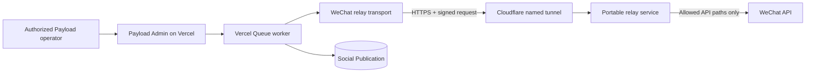

# WeChat Draft Relay Design

## Status

Approved in conversation on September 9, 2026. This design extends the existing manual social publishing architecture with a portable, authenticated egress relay for WeChat draft synchronization.

## Goal

Route WeChat draft API calls through a user-provided macOS or Linux host whose public IPv4 address can be added to the WeChat API allowlist. Expose the relay at `https://wechat-relay.chankay.com` through a named Cloudflare Tunnel while preserving the existing immutable snapshot, queue, and provider checkpoint behavior.

## Scope

The initial relay supports only the WeChat operations needed to obtain a token, upload article images and cover material, create a draft, and read the created draft. It must not forward publication submission or publication status operations. The current computer is not a runtime dependency; the relay will run on a separate host supplied by the operator.

The implementation includes:

- a portable Node.js relay service with a Docker image;
- a raw, authenticated request-forwarding protocol that preserves multipart uploads;
- an Admin-side relay transport selected by environment configuration;
- a narrowly scoped retry for a definitive token-stage failure that made no remote mutation;
- example runtime configuration and an operator runbook for Cloudflare Tunnel and the WeChat IP allowlist.

Provisioning the final host, creating the named Cloudflare Tunnel, setting production secrets, changing the WeChat allowlist, and retrying the live draft are operational steps performed after the software is reviewed and deployed.

## Considered Approaches

### Named Cloudflare Tunnel with a portable relay

This is the selected approach. `chankay.com` already delegates DNS to Cloudflare, so a named tunnel can provide the stable `wechat-relay.chankay.com` endpoint without opening an inbound router port. The relay and `cloudflared` can run on any operator-controlled macOS or Linux host.

### Quick Tunnel

A Quick Tunnel avoids Cloudflare DNS and account configuration, but its generated hostname can change whenever the process restarts. Updating Vercel configuration for each run makes recovery unreliable and error-prone.

### Outbound polling runner

A local runner could poll the Admin application and make WeChat calls without any inbound tunnel. It would require a second queue-consumer protocol, durable leasing, and additional authentication behavior. That would duplicate the existing Vercel Queue execution model and is unnecessary for the current low-volume workflow.

## Architecture

The existing `WeChatClient` continues to construct and validate WeChat requests and responses. A relay-aware fetch transport converts each permitted WeChat request into one signed request to the relay. The relay verifies the signature and request freshness, reconstructs the upstream request against the fixed `https://api.weixin.qq.com` origin, and streams the bounded response back to the worker.

If relay configuration is absent, the client retains its current direct transport. This keeps local mocked tests and future fixed-egress deployments usable without the relay. Production rollout must configure the relay explicitly before retrying the failed draft.

## Components

### Relay-aware Admin transport

The Admin application adds a small server-only transport module beside the WeChat adapter. It accepts only a fully constructed `Request` whose origin is exactly `https://api.weixin.qq.com` and whose path is in the draft-only allowlist. It materializes the request body once so multipart boundaries and binary media bytes are preserved, computes the signature, and sends the raw body to the configured relay endpoint.

The transport forwards only the upstream method, pathname, query, content type, and body. It does not forward cookies, authorization headers, Cloudflare headers, client IP headers, or arbitrary caller headers. It returns the relay response as a normal `Response`, allowing the existing WeChat client validation and ambiguity handling to remain authoritative.

### Portable relay service

The relay is a small Node.js HTTP service packaged as a workspace application and Docker image. It binds to `127.0.0.1` by default so only the local `cloudflared` process can reach it. Operators can override the bind address when a container network requires it.

The service exposes:

- `GET /healthz`, returning a minimal readiness response without configuration values;
- `POST /v1/wechat`, accepting authenticated, bounded proxy requests.

The proxy endpoint never accepts a hostname or absolute URL. It receives a method and relative target in signed headers, validates both against constants, and builds the upstream URL using the fixed WeChat origin. It does not log the target query, request body, signature, access token, AppID, AppSecret, or upstream response body.

### Cloudflare Tunnel

A named Cloudflare Tunnel maps `wechat-relay.chankay.com` to the relay on the operator-provided host. Cloudflare terminates public TLS and connects to `cloudflared`; the relay remains bound to the local interface or private container network. The repository provides example commands and configuration but does not store a tunnel token or Cloudflare credentials.

The host's outbound public IPv4 address, rather than a Cloudflare edge address, is the address WeChat observes and the address the operator must add to the WeChat API allowlist.

## Authentication Protocol

The Admin worker and relay share a dedicated high-entropy secret supplied through their respective secret-management mechanisms. The secret is separate from the WeChat AppSecret and Cloudflare tunnel credentials.

Each relay request carries:

- protocol version;
- Unix timestamp;
- cryptographically random nonce;
- upstream HTTP method;
- upstream relative target;
- upstream content type when present;
- SHA-256 digest of the raw request body;
- HMAC-SHA-256 signature over a canonical newline-delimited representation of all fields above.

The relay performs constant-time signature comparison, rejects timestamps outside a short clock-skew window, and stores accepted nonces in a bounded in-memory TTL cache. A nonce can be used only once within that window. The relay validates field lengths and character sets before canonicalization so alternate encodings cannot produce ambiguous signatures.

The relay shared secret remains in Vercel's secret manager and the relay host's runtime environment. The existing WeChat AppID and AppSecret remain in Vercel's secret manager. The stable-token request body passes through the authenticated TLS tunnel transiently and is never persisted or logged by the relay.

## Request Restrictions

The initial upstream path allowlist is:

- `/cgi-bin/stable_token`
- `/cgi-bin/media/uploadimg`
- `/cgi-bin/material/add_material`
- `/cgi-bin/draft/add`
- `/cgi-bin/draft/get`

The relay rejects `/cgi-bin/freepublish/submit`, `/cgi-bin/freepublish/get`, redirects to another origin, non-HTTPS upstream behavior, unknown methods, malformed query strings, oversized headers, oversized bodies, and responses above the configured limit.

The relay uses short connection and total request deadlines. A failure before the relay receives an upstream response is reported as a transport failure. When a mutation request may have reached WeChat, the failure preserves the existing ambiguous-result classification; the relay does not convert it into a safe retry.

## Configuration Contract

The Admin application adds environment variable names to `apps/admin/.env.example`:

- `WECHAT_RELAY_URL`, expected to be the exact HTTPS endpoint `https://wechat-relay.chankay.com/v1/wechat`;
- `WECHAT_RELAY_SHARED_SECRET`, the dedicated request-signing secret.

The relay application provides an example environment template containing names only:

- `WECHAT_RELAY_SHARED_SECRET`;
- `WECHAT_RELAY_HOST` with a safe localhost default for direct host execution;
- `WECHAT_RELAY_PORT` with a documented unprivileged default.

Real environment files, tunnel credentials, and secret values are never committed or inspected by the implementation workflow.

## Recovery for the Existing `40164` Failure

The current publication failed while obtaining a token. It has no access token checkpoint, uploaded media, remote draft identifier, submission identifier, or publication identifier. WeChat returned a definitive response, so the result is not ambiguous, but the provider classified the code as non-retryable because retrying without an allowlist change cannot succeed.

The state policy will permit an explicit `create-draft` retry only when all of the following are true:

- publication status is `failed`;
- the last error stage is `token`;
- the last result is not ambiguous;
- no remote media, draft, submission, or publication identifier exists;
- the source and immutable snapshot still pass the normal freshness and hash checks;
- the Social Account remains enabled and matches the snapshotted destination.

The Admin UI labels this action `Retry draft after connectivity fix`. It uses the existing hash-bound command and queue transition, clears the prior error only in the atomic queued transition, and appends a new audit attempt. It does not introduce a generic force-retry command.

## Data Flow

1. An authorized operator reviews the existing immutable prepared publication and selects the connectivity-recovery retry.
2. The shared command service revalidates the snapshot, source, destination, and narrowly scoped retry conditions.
3. The command atomically transitions the record from `failed` to `draft_queued` and dispatches the identifier-only queue message.
4. The worker resolves the existing Vercel-managed WeChat credentials and constructs the stable-token request.
5. The relay transport signs and sends the raw request through `wechat-relay.chankay.com`.
6. The relay validates the request, forwards it to the fixed WeChat origin from the operator host, and returns the bounded response.
7. The existing adapter uploads media, creates the remote draft, reads it back, and checkpoints remote identifiers exactly as it does today.
8. The worker transitions the publication to `draft_ready` only after the remote draft round-trip passes existing snapshot checks.

No step submits the draft for publication.

## Error Handling

- Missing or partial relay configuration fails closed before any network request.
- Invalid relay URLs, non-HTTPS endpoints, embedded credentials, query strings, and unexpected paths are rejected during startup or request construction.
- Authentication, freshness, replay, allowlist, size, and timeout failures return generic bounded errors without echoing sensitive input.
- Upstream WeChat responses are passed through without relay logging and remain subject to the existing bounded JSON parsing and error normalization.
- Draft mutation failures retain the existing ambiguity rules and remote checkpoints.
- Tunnel downtime produces a retryable transport error. Automatic queue redelivery still cannot create duplicate mutations because the existing claim, checkpoint, and ambiguity rules remain in force.

## Testing

Tests will be written before implementation and will cover:

- deterministic canonical signatures and constant-time verification;
- expired timestamps, duplicate nonces, malformed fields, and invalid signatures;
- fixed origin and draft-only path enforcement;
- exact multipart byte and content-type forwarding;
- request and response size limits and timeouts;
- relay transport selection only when complete configuration is present;
- redaction-safe error behavior;
- explicit retry eligibility for a non-ambiguous token failure with no remote state;
- rejection of retries with media checkpoints, remote identifiers, ambiguity, source drift, or any non-token stage;
- the Admin action label and command behavior;
- existing direct-client tests and the full Admin test and type-check suites.

A local smoke test will run the relay against a mock upstream or injected fetch implementation. Live WeChat traffic is an operator acceptance step after the host, tunnel, shared secret, and allowlist are configured.

## Deployment Sequence

1. Build and verify the relay and Admin changes locally.
2. Deploy the Admin change with relay routing disabled.
3. On the operator-provided host, install Docker or Node.js and `cloudflared`.
4. Create a named Cloudflare Tunnel and route `wechat-relay.chankay.com` to the local relay.
5. Configure the same relay signing secret in the host runtime and Vercel secret manager without exposing it in logs or chat.
6. Start the relay and tunnel and verify `/healthz` through the public hostname.
7. Determine the host's outbound public IPv4 address and add it to the WeChat API allowlist.
8. Enable `WECHAT_RELAY_URL` in the Admin deployment and verify a signed, non-mutating relay request.
9. Review the unchanged prepared snapshot and explicitly retry the existing token-stage failure.
10. Confirm the publication reaches `draft_ready` and inspect the draft in WeChat. Do not submit it for publication.

## Rollback

Remove the relay environment configuration from Vercel to restore the existing direct WeChat transport. Stop `cloudflared` and the relay process, then remove the DNS route or tunnel when it is no longer needed. Preserve the Social Publication audit record and any remote draft. Rollback never deletes a WeChat draft or publication automatically.

## Acceptance Criteria

- The relay runs on an operator-provided macOS or Linux host and is reachable at `https://wechat-relay.chankay.com` through a named Cloudflare Tunnel.
- Unsigned, stale, replayed, malformed, oversized, and non-allowlisted requests cannot reach WeChat.
- Multipart media bytes survive the relay unchanged.
- The relay cannot invoke WeChat publication endpoints.
- Secrets, tokens, request bodies, and sensitive query parameters do not appear in application logs or persisted Payload data.
- Existing direct WeChat adapter behavior remains available when relay configuration is absent.
- The existing `40164` publication can be explicitly retried only under the documented token-stage recovery conditions.
- The authorized live acceptance flow can create and inspect one WeChat draft without publishing it.
